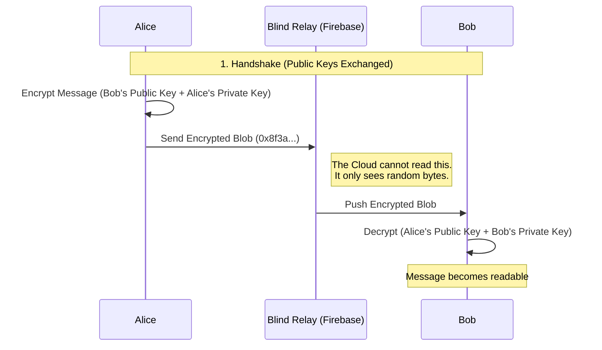

# PROJECT NYX

  

**Privacy is a right, not a feature.**

Project Nyx is a decentralized-style messaging application built to prove that secure communication doesn't require your phone number, email, or government ID. We use **Curve25519** cryptography to ensure that even if our database is compromised, your messages look like mathematical garbage to anyone but the intended recipient.

No trackers. No ads. No metadata mining. Just you and the person you're talking to.

-----

## 🧠 How it Works (The Architecture)

Unlike traditional chat apps that store your messages in plain text (or hold the keys themselves), ProjectNyx operates as a **Zero-Knowledge Relay**.

### The Security Model

We use the **Signal-style encryption flow**. Keys are generated locally on your device and never leave it.



### Identity Generation

Your identity is math, not a row in a database. We don't store passwords, which means we can't reset them. Your 12-word phrase is the seed for everything.


-----

## ✨ Features

  * **🚫 No Phone Numbers:** Sign up with a cryptographic key. Total anonymity.
  * **🔒 Session-Grade Encryption:** Uses `tweetnacl` (Curve25519) for high-speed, military-grade security.
  * **📱 Responsive Design:** Works flawlessly on Desktop, Mobile, and Tablets with a responsive split-view UI.
  * **🌗 Theming:** Beautiful Dark/Light modes with a clean, distraction-free interface.
  * **⚡ Real-Time:** Instant message delivery using Firestore snapshots.
  * **📸 Media Sharing:** Securely share images (Base64 encoded and encrypted).

-----

## 🛠️ Tech Stack

We kept the stack modern and fast. No legacy code here.

  * **Frontend:** [React](https://reactjs.org/) + [Vite](https://vitejs.dev/)
  * **Language:** [TypeScript](https://www.typescriptlang.org/) (Strict typing for security)
  * **Styling:** [Tailwind CSS](https://tailwindcss.com/) + [Radix UI](https://www.radix-ui.com/) primitives
  * **State:** [Jotai](https://jotai.org/) (Atomic state management)
  * **Crypto:** [TweetNaCl.js](https://github.com/dchest/tweetnacl-js) (Port of NaCl)
  * **Backend:** Google Firebase (Firestore) *used strictly as a blind data relay*.

-----

## 🚀 Getting Started

Want to run this locally or contribute? Follow these steps.

### Prerequisites

  * Node.js (v16 or higher)
  * npm or yarn
  * A Firebase project (free tier works fine)

### 1\. Clone the Repo

```bash
git clone https://github.com/NITHINSPACETIME/project-Nyx.git
cd project-Nyx
```

### 2\. Install Dependencies

Grab all the necessary packages.

```bash
npm install
```

### 3\. Configure Environment

You need to connect your own Firebase instance.

1.  Create a file named `src/lib/firebase.ts`.
2.  Paste your configuration keys (from Firebase Console -\> Project Settings):

<!-- end list -->

```typescript
// src/lib/firebase.ts
import { initializeApp } from "firebase/app";
import { getFirestore } from "firebase/firestore";

const firebaseConfig = {
  apiKey: "YOUR_API_KEY",
  authDomain: "YOUR_PROJECT.firebaseapp.com",
  projectId: "YOUR_PROJECT_ID",
  storageBucket: "YOUR_PROJECT.firebasestorage.app",
  messagingSenderId: "...",
  appId: "..."
};

const app = initializeApp(firebaseConfig);
export const db = getFirestore(app);
```

### 4\. Run Development Server

```bash
npm run dev
```

Open `http://localhost:5173` in your browser.

-----

## 🤝 Contributing

We welcome contributions\! Whether it's fixing a typo, improving the UI, or auditing the crypto implementation.

1.  **Fork** the repository.
2.  Create a new branch: `git checkout -b feature/amazing-feature`.
3.  Make your changes.
4.  **Commit** your changes:
    ```bash
    git add .
    git commit -m "feat: Added voice notes support"
    ```
5.  **Push** to the branch:
    ```bash
    git push origin feature/amazing-feature
    ```
6.  Open a **Pull Request**.

### Roadmap

  - [ ] Voice & Video Calls (WebRTC)
  - [ ] Group Chats
  - [ ] Disappearing Messages (TTL)
  - [ ] Desktop Electron App

-----

## ⚠️ Security Disclaimer

*This project is currently in **Alpha**. While we use standard cryptographic libraries (TweetNaCl), this specific implementation has not yet undergone a third-party security audit. Use for casual privacy, but maybe stick to Signal for whistleblowing on governments (for now).*

-----

**Built by NITHINSPACETIME**
